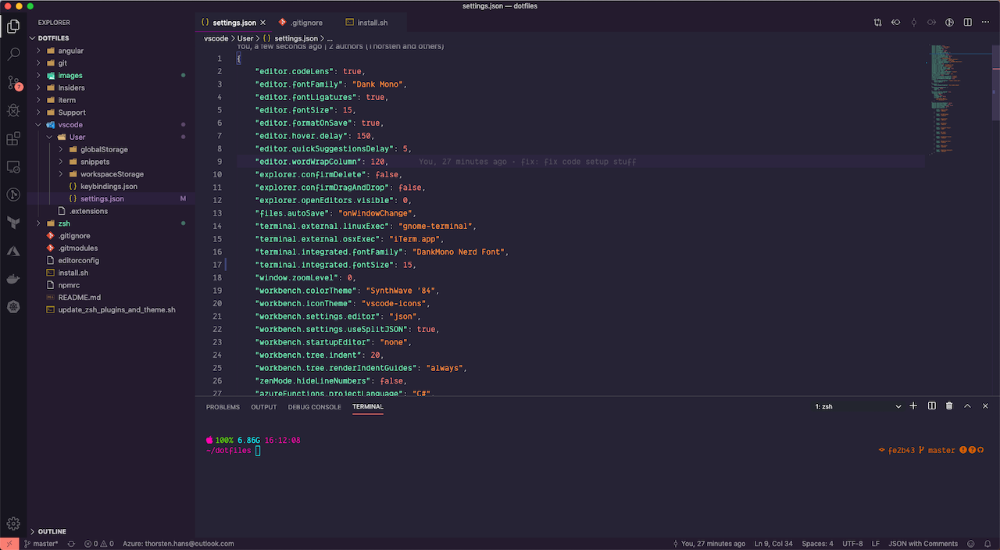

# Thorsten Hans' dotfiles

This repository contains my dotfiles for

- zsh (oh-my-zsh)
  - powerlevel9k
  - zsh-syntax-highlighting
  - zsh-autosuggestions
- git
  - global `.gitconfig`
  - global `.gitignore`
- editorconfig
- Angular
  - set YARN as package manager
  - disable CLI analytics  
- NPM
  - npm init defaults
- iTerm2
  - with custom profiles for regular usage and presentations
- Visual Studio Code
  - supports both Visual Studio Code and Visual Studio Code Insiders
  - Installs a set of extensions I use (see [.extensions](./vscode/.extensions))

## Font

I use [Dank Mono](https://dank.sh/) for both, Terminal and VSCode. On top I've patched the font in order to work seamlessly with Powerlevel9k using the font-patcher from [Nerd Fonts](https://github.com/ryanoasis/nerd-fonts).

## Requirements

If you're running macOS, you should checkout my [macOS setup repo](https://github.com/ThorstenHans/msetup). However, this script works for both macOS and linux.

- git
- zsh and oh-my-zsh
- Visual Studio Code (to install extensions automatically)
- iTerm2 (only if running on macOS and iTerm2 configuration requested during script execution)

## Usage

The [install script](./install.sh) can be executed without user interaction by providing the `--silent` flag. However, you may want to specify default values for variables used within the script. Check the variables section in the install script. If started without `--silent` the script will prompt for several configurable actions during script execution.

### Interactive execution

```bash
./install.sh

```

### Non-Interactive execution (silent)

```bash
./install.sh --silent

```

## Updating ZSH Plugins and Theme

I decided to clone repos for plugins (auto-suggestions and syntax-highlighting) and theme (powerlevel9k) explicitly. You can hook up the [update script](./update_zsh_plugins_and_theme.sh) into your `.zshrc` or invoke it manually to ensure using latest versions.

```bash
./update_zsh_plugins_and_theme.sh

```

## Screenshots

Here some screenshots.

### macOS




### Ubuntu


